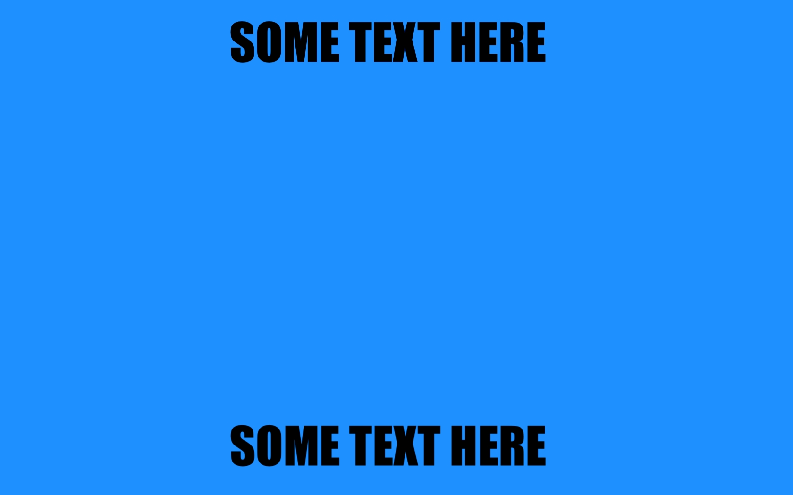
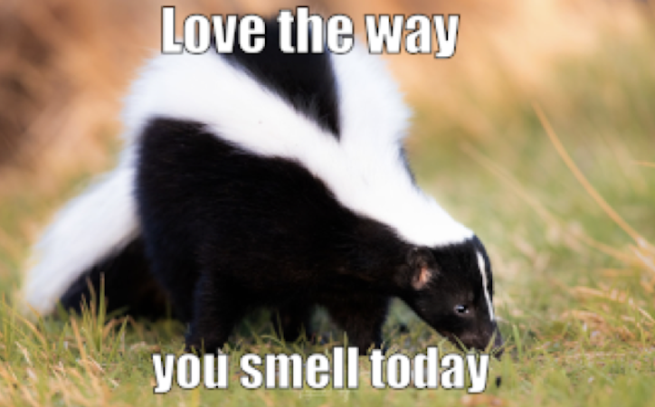
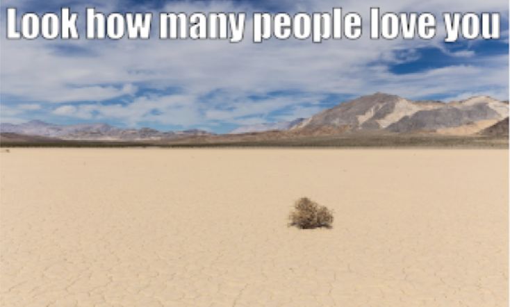
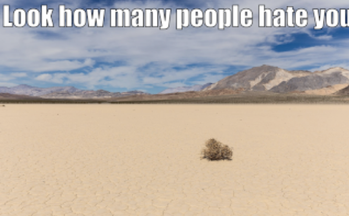

```{r setup, include=FALSE}
knitr::opts_chunk$set(echo = TRUE)
library(knitr)
```

In this activity, we will learn about detecting hate speech in unimodal and multimodal data! The idea for this project comes from the [The Hateful Memes Challenge: Detecting Hate Speech in Multimodal Memes](https://proceedings.neurips.cc/paper/2020/file/1b84c4cee2b8b3d823b30e2d604b1878-Paper.pdf) paper by Douwer Kiela, Hamed Firooz, Aravind Mohan, Vedanjuj Goswami, Amanpreet Singh, Pratik Ringshia, and Davide Testuggine at Facebook AI.

### Motivation

Like a lot of other people, this paper caught my eye because I saw the word __memes__ in the title! However, this paper is more about efficiency and ethics of models that are used in detecting hate speech, specifically through hateful memes. If you are an internet user in 2021, you likely have come across hateful memes. Detecting hate speech accurately is a big problem in today's age online.

### Unimodality vs Multimodality

In simple terms, modality of data refers to the number of different *types* of data. 

\textcolor{red}{Note:} The uni/multimodalilty in this activity is different from the modality that refers to the __mode__ (the value that appears most often) of data. 

The aim of the Hateful Memes paper is to test the effectiveness of the existing machine learning models in detecting hate speech, via memes. In order to do this, the researchers created a challenge dataset^[This dataset is challenging because for every hateful meme, there exist non-hateful memes that are flipped versions of the hateful one.] of $10,000$ memes. Here is what a __multimodal__ meme in this dataset would look like:

```{r, echo=FALSE, out.width='50%', fig.align='center'}

```

These memes have a background image **and** some text, that is they are __bimodal__ or more generally, __multimodal__. Part of the challenge dataset contains __unimodal__ data, that is, data that is just textual or just the image.

### The Experiment

The task is of __binary classification__, which falls under supervised machine learning, and is a topic we have seen in class. Using some examples from this challenge dataset/paper, we will go through the experiment of classifying if a meme is hateful or not.

Please don't do the questions out of order, since they build upon each other!

\textcolor{red}{Note:} Since the actual memes in this dataset were hurtful, I have chosen "mean" examples from the paper instead. These examples demonstrate the same idea.

#### 1. Unimodal Memes.

For each of the texts below, indicate whether you would classify it as hateful or non-hateful.

a. Love the way you smell today
b. Look how many people love you

What did you decide? Did you have trouble classifying? The truth is, it could be interpreted both as hateful or non-hateful depending on the context. Therefore, unimodal data is hard to classify As humans, with ability to understand context, we couldn't figure it out - so what do you think a machine would have done?

--- Rest of the page is blank so you don't accidentally view question 2 ---

\newpage

#### 2. Multimodal Memes.

Now look at the same memes below. Now they have images associated with the text. How would you classify them? Has your answer changed?

a. 
```{r, echo=FALSE, out.width='50%', fig.align='center'}

```

b. 
```{r, echo=FALSE, out.width='50%', fig.align='center'}

```

Having another modality made it easier as humans to detect what hate speech is!

--- Rest of the page is blank so you don't accidentally view question 3 ---

\newpage

#### 3. More Multimodal Memes.

Now look at the following memes. What do you think about your answer now? Did it change again?

a. 
```{r, echo=FALSE, out.width='50%', fig.align='center'}

```

b. 
```{r, echo=FALSE, out.width='50%', fig.align='center'}

```

In part a, we changed the image, and in part b, we changed the text - but changing either of these flipped the classification of the meme! 

\newpage

### Debrief

As we went through steps 1, 2, and 3, we better understand unimodality and multimodality and how multimodal data is better. As humans, we have better judgment, with the maximum classification accuracy of about 85%. Comparatively, state of the art machine learning models have a maximum accuracy of about 66% (Visual BERT COCO Model), which is far away from human performance.

In the larger ML framework, detecting hate speech accurately is an important issue. There is not enough work done to better the models since the state-of-the-art models are poor. This can have a hugely negative impact. This paper brings up conversation about work in multimodal reasoning and understanding. It also opens up the floor to the wider ML community via the Hateful Memes Challenge.

### Extra: The Hateful Memes Challenge

Together with publishing this paper, Facebook AI released the [Hateful Memes Challenge](https://hatefulmemeschallenge.com) where people could do there own experiments using the challenge dataset for better classification of hateful memes. Currently, some people have managed to beat the above machine accuracy to over 73% from 66%!

### Aside: What is hate speech? 

This paper defines hate speech as:

> A direct or indirect attack on people based on characteristics, including ethnicity, race, nationality, immigration status, religion, caste, sex, gender identity, sexual orientation, and disability or disease. We define attack as violent or dehumanizing (comparing people to non-human things, e.g. animals) speech, statements of inferiority, and calls for exclusion or segregation. Mocking hate crime is also considered hate speech.
‌


